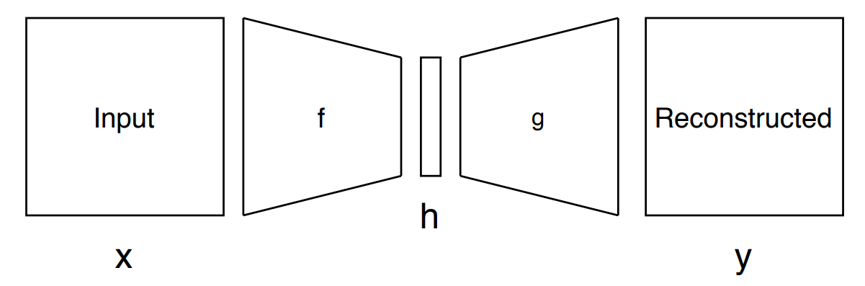
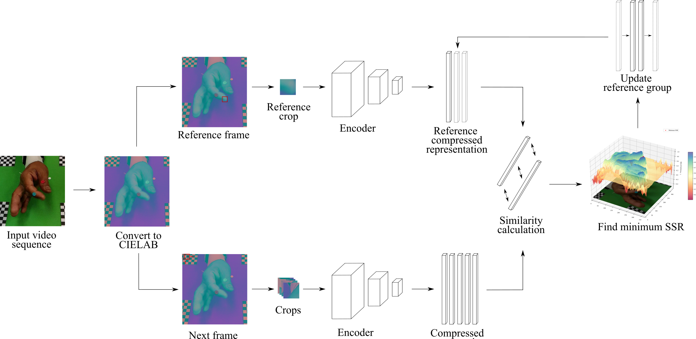
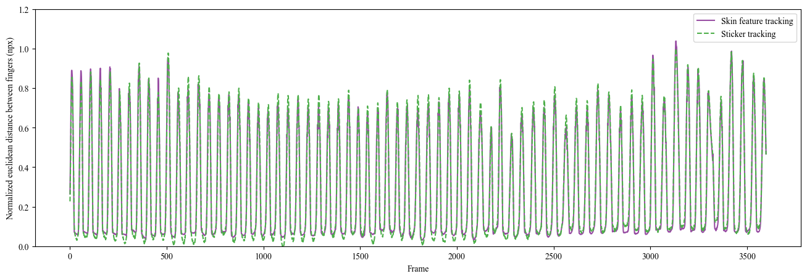
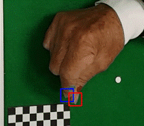

# Skin feature tracking using Deep encoder
This project utilizes the AutoEncoder to track the skin feature.
The tracking algorithm is able to reach sub-pixel level accuracy.
This project is a part of the Nordlinglab 

## The basics of AutoEncoder
AutoEncoder is a typical deep neural model which can transfer and reconstruct input data.
The AutoEncoder is composed of the decoder part and the encoder part.
The encoder part is used to transfer the input data into another representation space.
And the decoder part is used to reconstruct the input data from the representation space.
We utilize the encoder to achieve the feature tracking
* The artichture of AutoEncoder

## The detail about the skin feature tracking
The detail about the AutoEncoder and skin feature tracking is described in [Chang2021](https://arxiv.org/abs/2112.14159), including the training and validation.
This repository improves the tracking algorithm proposed by [Chang2021](https://arxiv.org/abs/2112.14159) and make it able to track rapid movement skin feature such as FTT.

## Tracking algorithm
In contrast to the previous tracking algorithm, we add the "reference group" to improve the robustness.
The idea of the reference group is to add more than one reference target to the algorithm.
* Flowchart of the skin feature tracking

## Result

## Reference
Chang, J. R., & Nordling, T. E. (2021). Skin feature point tracking using deep feature encodings. arXiv preprint arXiv:2112.14159.

